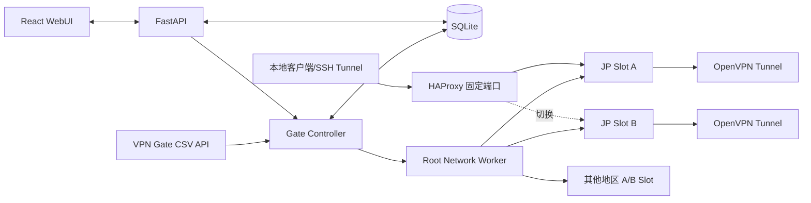

# Gate 完整项目方案书

> 文档版本：1.0
>
> 编制日期：2026-09-02
>
> 代码仓库：`ClaraCora/gate`
>
> 部署目标：SSH 主机别名 `HK-Aliyun`

## 1. 项目概述

Gate 是一个运行在单台 Linux VPS 上的多地区 SOCKS5 出口控制系统。系统从 VPN Gate 公共
API 获取志愿者 VPN 节点，为预设地区建立独立 OpenVPN 隧道，并向使用者提供固定不变的
SOCKS5 端口。底层节点可以因质量变化或故障自动切换，但客户端不需要修改代理配置。

系统同时提供 WebUI，用于查看各地区端口、活动出口、线路质量、历史可用率和任务状态，并
支持立即测试、选择节点、手动切换、锁定线路、恢复自动模式和查看失败原因。

本项目采用 Windows 开发、SSH 部署到 VPS 的工作方式。Windows 负责代码、单元测试、前端
构建和发布打包；所有 network namespace、OpenVPN、nftables、HAProxy 和防泄漏验证都在
真实 VPS 上执行。

## 2. 背景与约束

VPN Gate API 当前提供 CSV 数据，主要字段包括：

- 节点主机名和 IP
- VPN Gate 自身的 Score、Ping 和 Speed
- 国家名称和两位国家代码
- 当前 VPN 会话数、运行时间、累计用户和流量
- 日志策略、运营者和消息
- Base64 编码的 OpenVPN 配置

设计必须接受以下客观约束：

1. API 只有国家粒度，没有可靠的城市粒度。
2. API 中的 Ping 和 Speed 不是从本 VPS 测得，只能作为粗筛指标。
3. 志愿者节点随时可能消失、变慢、改协议或拒绝连接。
4. 部分目标地区长期没有可用节点，不能保证每个端口始终在线。
5. OpenVPN 配置来自不可信远端，不能直接以 root 权限执行。
6. 多条 OpenVPN 隧道会同时修改默认路由，必须进行网络隔离。
7. VPN 断开时不能让 SOCKS 流量回落到 VPS 原始公网出口。

2026-09-01/02 的一次实际 API 快照约有 99 个节点、12 个国家，其中日本 52 个、韩国
25 个。该分布说明日本和韩国通常更容易满足高可用要求，而北美、欧洲及东南亚需要接受
“无可用出口”的正常状态。

## 3. 项目目标

### 3.1 核心目标

- 为每个逻辑地区提供固定 SOCKS5 端口。
- 从 VPN Gate 自动发现、过滤、测试并选择真实可用节点。
- 以 VPS 实测数据而不是 VPN Gate 排名作为主要决策依据。
- 支持健康检查、自动故障转移和带迟滞的质量优化。
- 支持手动测试、手动切换、线路锁定和自动模式恢复。
- 切换失败时保持旧线路或自动回滚。
- VPN 掉线时阻断代理流量，避免原始 VPS 出口泄漏。
- 用 WebUI 清晰展示运行状态、候选节点、任务和历史事件。
- 支持从 Windows 使用一个 PowerShell 命令通过 SSH 发布。

### 3.2 非功能目标

- 单台 2 vCPU / 4 GiB VPS 可稳定运行 5 个活动地区。
- API 与控制面不以 root 身份运行。
- 服务重启和 VPS 重启后能够恢复上次期望状态。
- 关键任务可重试、可审计，不因浏览器关闭而中断。
- 日志和数据库有明确的保留及容量上限。
- 配置、状态机和评分算法可通过自动化测试验证。

### 3.3 第一阶段不包含

- 多 VPS 集群、跨机调度或分布式高可用。
- VPN Gate 无法提供的城市级出口保证。
- 面向公众的匿名代理服务或用户计费系统。
- 对任意 VPN 提供商配置格式的通用兼容。
- 第一版的 SOCKS5 UDP 保证；MVP 以 TCP 和远端 DNS 为主。
- 对公共志愿者节点可用性、隐私或性能作商业 SLA 承诺。

## 4. 预设地区与端口

初始配置如下。国家集合、端口和入口数量由配置文件管理, 日常启停状态由 WebUI 管理：

| ID | 显示名称 | 国家代码 | SOCKS5 端口 |
| --- | --- | --- | ---: |
| `jp` | 日本 | `JP` | `11081` |
| `kr` | 韩国 | `KR` | `11082` |
| `na` | 北美 | `US, CA` | `11083` |
| `eu` | 欧洲 | `DE, NL, FR, GB, RO, PL, ES, IT, SE, FI, CH, AT` | `11084` |
| `sea` | 东南亚 | `SG, TH, VN, ID, MY, PH` | `11085` |

地区选择遵循严格匹配：目标国家集合没有合格节点时，端口进入 `UNAVAILABLE`，不能自动使用
集合以外的国家。WebUI 可以明确发起一次临时跨地区选择，但必须显示警告并留下事件记录。

### 4.1 单地区多入口

一个逻辑地区可以声明多个入口实例。入口实例拥有独立 `id`、SOCKS 端口、network namespace
地址段和 A/B slot, 并通过 `group_id` 归入同一地区。自动选择和手动切换都会排除同组其他
活动入口已使用的节点; 候选通过隔离测试后, 提交切换前还必须比较真实出口 IP。同组已存在
相同节点或相同出口 IP 时拒绝接入并保持原线路。预置但关闭的入口不启动 OpenVPN 或
sing-box, 因此可按容量预留端口而不产生对应的隧道资源占用。

## 5. 总体架构



系统拆分为五个职责明确的组件：

| 组件 | 权限 | 主要职责 |
| --- | --- | --- |
| `gate-api` | 普通用户 | REST API、会话认证、WebUI 静态资源、SSE |
| `gate-controller` | 普通用户 | 拉取节点、调度探测、评分、状态机、任务队列 |
| `gate-worker` | root | 受限地操作 netns、nftables、OpenVPN 和 SOCKS 进程 |
| HAProxy | 独立服务用户 | 固定 SOCKS 端口与活动 A/B 后端之间的 TCP 转发 |
| SQLite | 文件权限隔离 | 配置副本、运行状态、测量结果、任务和事件 |

Web/API 不拼接或执行 shell 命令。所有特权操作通过本机 Unix Socket 发送给
`gate-worker`，请求使用固定 schema 和枚举动作；worker 通过 `SO_PEERCRED` 校验调用者，
并对地区 ID、slot、IP、端口、文件路径和操作顺序再次验证。

`gate-worker` 不启用会创建私有挂载命名空间的 systemd 文件系统沙箱项，因为 `ip netns`
依赖将命名空间 bind mount 发布到宿主 `/run/netns`，供 transient unit 使用。其边界改由能力
白名单、地址族限制、`NoNewPrivileges`、peer UID 校验、严格请求 schema 与无 shell 子进程共同
约束；OpenVPN 和 sing-box transient unit 仍各自在目标 netns 内使用文件系统沙箱。

## 6. 技术选型

### 6.1 后端与控制器

- Python 3.13
- FastAPI + Uvicorn
- Pydantic Settings 与严格请求模型
- SQLAlchemy 2 + Alembic
- SQLite WAL 模式
- `httpx` 访问 VPN Gate 和探测目标
- APScheduler 或内部持久化调度循环
- pytest、pytest-asyncio、mypy、Ruff

选择 Python 的原因是开发效率高、CSV/网络测量生态成熟，且该项目的数据面由 OpenVPN、
HAProxy 和 SOCKS 服务承担，Python 不位于代理流量热路径。

### 6.2 WebUI

- React + TypeScript + Vite
- TanStack Query 管理 API 数据
- SSE 接收任务、状态和事件更新
- React Router
- Vitest + Testing Library
- Playwright 执行关键工作流端到端测试

生产部署只包含构建后的静态文件，不要求 VPS 运行 Node.js。

### 6.3 数据面

- OpenVPN 2.6：连接 VPN Gate 节点
- Linux network namespace：隔离每条 VPN 的接口和路由
- nftables：命名空间 kill switch、主机 NAT 与访问限制
- sing-box：在命名空间内提供 SOCKS5 服务
- HAProxy：将稳定端口转发到活动 slot，并支持 drain 和运行时切换
- systemd：服务管理、重启、权限限制和日志接入

第一版使用 HAProxy 原样转发 SOCKS5 TCP。客户端使用 `socks5h`，域名交给出口侧解析。
如后续明确需要 SOCKS5 UDP，应增加 nftables UDP 映射并单独完成协议与泄漏测试，不能假定
HAProxy TCP 方案自动支持 UDP。

## 7. 网络与 A/B Slot 设计

每个地区拥有两个地址固定的 slot，例如：

| 地区 | Slot | network namespace | 命名空间地址 |
| --- | --- | --- | --- |
| 日本 | A | `gate-jp-a` | `10.253.1.2/30` |
| 日本 | B | `gate-jp-b` | `10.253.2.2/30` |
| 韩国 | A | `gate-kr-a` | `10.253.3.2/30` |
| 韩国 | B | `gate-kr-b` | `10.253.4.2/30` |

每个 slot 通过一对 veth 与宿主机连接。命名空间初始默认路由指向宿主机，仅用于 OpenVPN
连接指定的 VPN 服务器。OpenVPN 建立后，代理业务流量的默认路由进入 `tun0`。

受控配置启用 `route-nopull`，不接受服务端任意下发路由和 DNS。worker 先为 VPN 服务器写入
指向 veth 的精确 `/32` 路由，确认 `tun0` 地址就绪后再安装业务默认路由。命名空间 DNS 使用
固定解析器并经 `tun0` 访问，SOCKS 客户端使用远端解析模式。第一版在命名空间内禁用 IPv6；
只有同时实现 IPv6 隧道路由、DNS 和 kill switch 后才允许启用，避免 IPv6 绕过 IPv4 VPN。

命名空间 nftables 规则遵循默认拒绝：

- 允许 loopback。
- veth 入站只允许宿主机地址访问 SOCKS 监听端口。
- veth 出站只允许连接当前 VPN 服务器的精确 IP、端口和协议。
- 业务流量只允许从 `tun0` 出站。
- 禁止 SOCKS 服务监听 `tun0`。
- `tun0` 消失时，没有任何通往普通互联网的回退路径。

宿主机仅对各命名空间的 VPN 握手流量做源 NAT。OpenVPN 远端使用 API 行中的 IP，避免为
建立 VPN 而依赖潜在泄漏的宿主机 DNS。

## 8. SOCKS 固定入口与切换流程

HAProxy 为每个地区配置两个静态后端，后端地址对应固定的 A/B slot。活动后端接受新连接，
备用后端默认 disabled 或 drain。

一次安全切换必须按以下顺序执行：

1. 为目标地区取得互斥锁，任务状态设为 `PREPARING`。
2. 选择非活动 slot，清理其上次残留状态。
3. 净化并生成候选节点的受控 OpenVPN 配置。
4. 创建命名空间、veth、路由和 kill switch。
5. 启动 OpenVPN，等待明确的连接成功事件，超过时限则失败。
6. 启动命名空间内 SOCKS 服务。
7. 绕过 HAProxy，直接对备用后端执行完整出口测试。
8. 通过 HAProxy runtime socket 启用新后端并停止向旧后端分配新连接。
9. 通过稳定 SOCKS 端口再次验证出口 IP、国家、DNS 和 HTTPS。
10. 验证失败则立即恢复旧后端；成功则提交数据库活动状态。
11. 旧后端 drain 3 至 5 分钟后停止并清理。

数据库状态更新和 HAProxy 切换不是同一个事务，因此每一步都要可重入。服务重启后，控制器
以实际 netns、进程和 HAProxy 状态为准进行 reconcile，而不是盲信数据库的最后记录。

## 9. OpenVPN 配置净化

VPN Gate 返回的 Base64 内容是非可信配置。禁止直接保存后执行。净化器执行以下流程：

1. Base64 严格解码并限制最大字节数。
2. 解析配置语法和内联区块，不使用字符串替换拼接配置。
3. 仅提取 `proto`、`remote`、密码算法和必要证书材料。
4. `remote` 必须是合法公网 IP，且与 API 节点 IP 一致。
5. 协议只允许 OpenVPN 支持的 TCP/UDP 形式，端口必须在 `1..65535`。
6. 内联证书和密钥必须是合法 PEM，且有单独大小限制。
7. 重新生成由 Gate 控制的配置，所有运行、日志和路由参数由模板提供。

明确拒绝以下输入：

- `up`、`down`、`route-up`、`ipchange` 和任何脚本指令
- `plugin`、`script-security`、`management`、`management-client`
- 外部文件路径、相对路径、管道、设备路径和环境变量引用
- 自定义日志、状态和 PID 文件路径
- 代理跳转、任意路由、服务端推送的危险配置
- 未识别且可能影响执行、文件或网络权限的指令

OpenVPN systemd 单元还应使用 `ProtectSystem`、`PrivateTmp`、`NoNewPrivileges`、能力白名单和
资源限制。配置净化与系统沙箱需要同时存在，不能互相替代。

## 10. 节点发现与粗筛

控制器默认每 10 分钟获取一次 VPN Gate API，并增加随机抖动，避免多个实例固定在整点请求。
解析器必须兼容 API 的首行标记、带 `#` 的 CSV 表头、尾部 `*` 和非标准换行。

节点唯一键建议由以下内容构成：

```text
country + ip + openvpn protocol + openvpn port + certificate fingerprint
```

粗筛的硬条件：

- 国家属于目标地区集合。
- OpenVPN 配置通过净化。
- IP、协议和端口有效。
- 节点不在人工黑名单或自动冷却期。
- 节点最近一次发现仍在允许的新鲜度范围内。
- 运行时间、API Speed 和负载达到可配置最低要求。

粗筛只决定“值得实测”的 Top K 候选，不能直接决定活动出口。VPN Gate 的 Ping、Speed 和
Score 仅占最终质量分的一小部分。

## 11. VPS 真实链路测试

候选测试在非活动 slot 内建立真实 OpenVPN 隧道。每个候选至少执行：

| 测试 | 判定目的 |
| --- | --- |
| OpenVPN 握手 | 远端是否可达、证书和算法是否兼容 |
| 两个独立出口 IP 服务 | 验证出口确实变化，降低单一检测服务误判 |
| GeoIP 国家验证 | 确认出口位于允许国家集合 |
| HTTPS 请求 | 验证 TCP、TLS 和基本 Web 可用性 |
| `socks5h` 域名请求 | 验证远端 DNS 解析路径 |
| 多次短请求 | 计算中位数、P95 延迟和成功率 |
| 限量下载 | 测量实际吞吐，不依赖 API Speed |

GeoIP 服务可能存在数据库差异，因此使用至少两个来源。两个来源冲突时节点进入
`GEO_UNCERTAIN`，不自动成为活动出口，但允许用户在 WebUI 查看并人工确认。

限量下载默认 2 至 5 MiB，只在首次验证、每 6 小时重评或用户点击完整测速时执行。普通健康
检查只发起很小的 HTTPS 请求，避免浪费 VPS 流量和志愿者资源。

## 12. 评分与自动选择

所有分项归一化到 `0..1`，最终分数为 `0..100`：

```text
quality = 100 * (
  0.35 * availability_24h
  + 0.25 * latency_score
  + 0.20 * throughput_score
  + 0.10 * api_speed_score
  + 0.05 * uptime_score
  + 0.05 * load_score
)
```

推荐归一化原则：

- `availability_24h`：最近 24 小时成功探测数 / 总探测数，并设置最小样本修正。
- `latency_score`：以 HTTPS 中位延迟为主，使用指数衰减，避免少量极端值主导。
- `throughput_score`：对 Mbps 使用对数缩放，达到目标速率后收益递减。
- `api_speed_score`：VPN Gate Speed 对数缩放，只作辅助。
- `uptime_score`：运行时间越长越高，达到阈值后封顶。
- `load_score`：当前会话越少越高，但不因会话多单独淘汰稳定节点。

自动优化采用迟滞规则：

- 候选分数至少比当前节点高 15%。
- 候选需连续两轮优于当前节点。
- 自动切换成功后冷却 30 分钟。
- 同一失败节点按指数退避进入 5 分钟至 6 小时冷却。
- 用户锁定活动节点后不做质量优化，但仍执行健康检查。
- 锁定节点彻底失效时默认保持故障并告警；是否允许紧急故障转移由地区设置决定。

## 13. 健康检查与故障转移

默认调度建议：

| 任务 | 周期 | 说明 |
| --- | --- | --- |
| VPN Gate 列表刷新 | 10 分钟 | 带 0 至 60 秒抖动 |
| 活动出口轻量健康检查 | 60 秒 | 小型 HTTPS + 出口 IP |
| 地区候选重排 | 30 分钟 | 使用历史与最新 API 数据 |
| 完整吞吐测试 | 6 小时 | 仅 Top 候选或用户触发 |
| 状态 reconcile | 2 分钟 | 对齐数据库与实际系统状态 |
| 数据保留清理 | 每日 | 删除过期原始探测与任务日志 |

活动线路连续 3 次轻量检查失败后进入 `DEGRADED` 并启动故障转移。默认采用冷备用策略：平时
只保持一个活动隧道，故障时在备用 slot 启动最近验证过的候选，预计恢复时间 20 至 90 秒。

如果某地区需要更短恢复时间，可开启热备用。热备用会长期维持第二条 VPN 和 SOCKS 进程，
恢复时间可降至数秒，但内存、连接数及对志愿者节点的资源占用近似翻倍。

## 14. 状态机

地区运行状态：

```text
DISABLED -> STARTING -> HEALTHY -> DEGRADED -> FAILING_OVER
                    \-> UNAVAILABLE          \-> HEALTHY
HEALTHY -> SWITCHING -> HEALTHY
                   \-> ROLLING_BACK -> HEALTHY/UNAVAILABLE
```

节点状态：

```text
DISCOVERED -> FILTERED -> TESTING -> READY -> ACTIVE
                         \-> FAILED -> COOLDOWN -> FILTERED
```

任务状态：

```text
QUEUED -> RUNNING -> SUCCEEDED
                  -> FAILED
                  -> CANCELLED
```

每次状态变化必须写入事件表，包含原因代码、地区、节点、任务、耗时和面向用户的简短说明。
日志中的异常堆栈与 UI 文案分离，避免向浏览器泄漏系统路径或敏感配置。

## 15. WebUI 信息架构

### 15.1 总览页

首页使用一张可扫描的地区状态表，不使用大量装饰性卡片。建议列包括：

- 地区和固定 SOCKS 端口
- 自动、锁定、禁用模式
- 健康、降级、切换中、不可用状态
- 当前出口 IP、国家、VPN 协议和端口
- 综合分数、延迟、成功率、吞吐
- 当前连接时长、最后健康检查、下次重评时间
- 立即测试、切换出口、重新连接、锁定/解锁操作

状态不能只依赖颜色，还要显示图标和文字。任务进行中时操作按钮保持固定尺寸，显示进度且防止
重复提交。

### 15.2 地区详情页

候选节点以表格展示：

- 国家、IP、协议、VPN Gate 指标
- VPS 实测延迟、吞吐、成功率、出口国家
- 最近成功和失败时间、连续失败次数、冷却剩余时间
- 当前状态和不合格原因
- 快速测试、完整测速、切换到此节点、加入黑名单

手动切换默认先测试再切换。用户可以选择“仅测试”，测试任务不会影响活动线路。

### 15.3 任务与事件页

- 当前运行和排队任务
- 最近切换、回滚、健康变化和配置变更
- 可按地区、级别、时间和结果筛选
- 失败事件提供稳定的错误代码和简短处置建议

### 15.4 设置页

- 地区名称、国家集合、端口和启停
- 自动切换阈值、冷却时间、检查周期和 Top K
- TCP/UDP 偏好与 TCP 443 回退偏好
- 锁定线路故障时的处理策略
- SOCKS 监听地址与认证策略
- 数据保留时间、日志级别和探测流量预算

配置提交前做前后端双重校验。端口冲突、国家代码错误和危险监听地址必须阻止保存。

### 15.5 实时更新

浏览器通过 SSE 接收以下事件：

- `region.updated`
- `probe.progress`
- `job.updated`
- `switch.progress`
- `event.created`

SSE 断开后使用最后事件 ID 恢复；恢复失败时重新获取当前快照，不能依靠漏掉的增量事件推断
系统状态。

## 16. API 草案

| 方法 | 路径 | 用途 |
| --- | --- | --- |
| `POST` | `/api/v1/session/login` | WebUI 登录 |
| `DELETE` | `/api/v1/session` | 退出登录 |
| `GET` | `/api/v1/regions` | 地区状态总览 |
| `GET` | `/api/v1/regions/{id}` | 地区详情 |
| `GET` | `/api/v1/regions/{id}/candidates` | 候选节点与实测数据 |
| `POST` | `/api/v1/regions/{id}/probe` | 测试当前或指定候选 |
| `POST` | `/api/v1/regions/{id}/switch` | 安全切换到指定候选 |
| `POST` | `/api/v1/regions/{id}/reconnect` | 重建当前活动线路 |
| `PUT` | `/api/v1/regions/{id}/mode` | 自动、锁定或禁用 |
| `GET` | `/api/v1/jobs/{id}` | 查询异步任务 |
| `POST` | `/api/v1/jobs/{id}/cancel` | 取消仍可安全取消的任务 |
| `GET` | `/api/v1/events` | 查询历史事件 |
| `GET` | `/api/v1/events/stream` | SSE 实时事件 |
| `GET` | `/api/v1/health/live` | 进程存活检查 |
| `GET` | `/api/v1/health/ready` | 数据库和 worker 就绪检查 |

所有修改操作要求 CSRF token、登录会话和幂等键。切换 API 立即返回 `202 Accepted` 与 job ID，
不能保持 HTTP 请求等待整个 OpenVPN 建连过程。

## 17. 数据模型

### 17.1 `regions`

- `id`、`name`、`countries_json`、`socks_port`
- `enabled`、`mode`、`locked_node_id`
- `failover_when_locked`、`selection_policy_json`
- `created_at`、`updated_at`

### 17.2 `nodes`

- `id`、`hostname`、`ip`、`country_code`
- `protocol`、`port`、`config_fingerprint`
- `sanitized_config_path`、`first_seen_at`、`last_seen_at`
- `blacklisted_until`、`blacklist_reason`

原始 Base64 配置默认不长期保存。净化配置保存在 root 可读目录，数据库只记录路径和指纹。

### 17.3 `node_observations`

- VPN Gate Score、Ping、Speed、Sessions、Uptime
- 日志策略摘要
- `observed_at`

### 17.4 `probe_runs`

- `region_id`、`node_id`、`job_id`、`probe_type`
- 握手耗时、出口 IP、GeoIP 结果
- 延迟中位数、P95、成功率、吞吐
- `result`、`error_code`、`started_at`、`finished_at`

### 17.5 `region_slots`

- `region_id`、`slot`、`node_id`
- `namespace_name`、`backend_address`
- `state`、`openvpn_unit`、`socks_unit`
- `started_at`、`last_verified_at`

### 17.6 `jobs` 与 `events`

`jobs` 保存持久化任务状态、进度、重试次数和错误代码；`events` 保存面向审计和 WebUI 的状态
变更。高频健康样本按保留策略聚合，避免 SQLite 无限增长。

## 18. 配置与密钥

非敏感配置使用 `/etc/gate/config.yaml`：

```yaml
api:
  listen: 127.0.0.1
  port: 18080

discovery:
  url: https://www.vpngate.net/api/iphone/
  fallback_urls:
    - https://r.jina.ai/http://www.vpngate.net/api/iphone/
  interval_minutes: 10
  top_k_per_region: 5

selection:
  improvement_ratio: 1.15
  confirmation_rounds: 2
  switch_cooldown_minutes: 30
  active_failure_threshold: 3

automation:
  enabled: true
  health_interval_seconds: 120
  max_candidates_per_cycle: 3

regions:
  - id: jp
    name: Japan
    countries: [JP]
    socks_port: 11081
    network_index: 1
  - id: kr
    name: Korea
    countries: [KR]
    socks_port: 11082
    network_index: 2
  - id: na
    name: North America
    countries: [US, CA]
    socks_port: 11083
    network_index: 3
  - id: eu
    name: Europe
    countries: [DE, NL, FR, GB, RO, PL, ES, IT, SE, FI, CH, AT]
    socks_port: 11084
    network_index: 4
  - id: sea
    name: Southeast Asia
    countries: [SG, TH, VN, ID, MY, PH]
    socks_port: 11085
    network_index: 5
```

敏感信息放在 `/etc/gate/secrets.env` 或 systemd credentials，包括 WebUI 会话密钥、管理员密码
哈希和可选 SOCKS 认证。该文件权限为 `0600`，不进入 Git、发布包或日志。

## 19. 安全设计

### 19.1 默认暴露面

- WebUI/API 只监听 `127.0.0.1:18080`。
- SOCKS 固定端口只监听 `127.0.0.1`。
- 使用者通过 `ssh -L` 访问。
- 不新增公网防火墙入口。
- 若未来公网开放，必须另行完成 HTTPS、强认证、IP 白名单、限速和安全评审。

### 19.2 Web 安全

- 管理员密码使用 Argon2id 哈希。
- Cookie 设置 `HttpOnly`、`SameSite=Strict`；经 HTTPS 发布时再设置 `Secure`。
- 修改请求必须校验 CSRF token 和 Origin。
- 登录、测速、切换和配置接口均有限速。
- 不在前端返回 OpenVPN 私钥、完整配置、系统路径或命令输出。

### 19.3 系统安全

- `gate-api`、`gate-controller` 和 HAProxy 使用不同的低权限用户。
- root worker 只接受白名单动作，不接受任意命令字符串。
- Unix Socket 由专用组控制，并校验 peer credentials。
- systemd 使用文件系统保护、设备限制、能力白名单和内存/进程限制。
- nftables 规则由独立 table 管理，更新前验证，避免破坏 VPS 现有防火墙。
- 所有生成文件写入固定目录，使用原子替换并拒绝符号链接。

### 19.4 流量与隐私

VPN Gate 运营者可能记录连接和流量元数据。Gate 默认不记录用户访问的目标域名和 URL，只记录
健康探测、节点、出口 IP 和系统事件。使用公共出口时仍必须依赖 HTTPS/TLS 保护内容。

## 20. Windows 开发与 SSH 部署

### 20.1 本地开发

Windows 安装 Git、Python、Node.js 和 OpenSSH Client。日常可运行：

- FastAPI、评分算法、CSV 解析和 SQLite 测试
- React WebUI 与 Mock API
- 配置净化的纯解析测试
- 前后端 lint、类型检查和单元测试

本地不模拟 Linux 网络。控制器依赖一个 `NetworkWorker` 接口：单元测试使用 `MockWorker`，VPS
使用 Unix Socket 对接真实 `LinuxWorker`。

### 20.2 仓库结构

```text
gate/
  backend/
    gate_api/
    gate_controller/
    gate_common/
    migrations/
  worker/
    gate_worker/
    templates/
  frontend/
    src/
  deploy/
    systemd/
    haproxy/
    nftables/
    bootstrap.sh
    install-release.sh
  scripts/
    dev.ps1
    test.ps1
    deploy.ps1
  tests/
    unit/
    integration/
    e2e/
  docs/
    PROJECT_PLAN.md
  README.md
```

### 20.3 发布布局

```text
/opt/gate/
  current -> /opt/gate/releases/<release-id>
  releases/
  shared/
/etc/gate/
  config.yaml
  secrets.env
/var/lib/gate/
  gate.db
  configs/
/var/log/gate/  # 仅在不完全使用 journald 时存在
```

### 20.4 PowerShell 部署入口

预期命令：

```powershell
.\scripts\deploy.ps1 -HostAlias HK-Aliyun
```

部署流程：

1. 检查本地分支和依赖，执行全部快速测试。
2. 构建 React 静态资源和 Python wheel/发布包。
3. 生成包含 Git commit、构建时间和校验和的 release manifest。
4. 通过 `scp` 上传到 VPS 临时文件名，校验后原子改名。
5. 通过 SSH 调用受控的 `install-release.sh`。
6. 创建新版本目录、Python venv，安装锁定依赖。
7. 运行 Alembic 数据库迁移。
8. 原子切换 `/opt/gate/current`。
9. 依次重启 worker、controller、api，重新加载 HAProxy。
10. 执行就绪检查和至少一个地区的稳定端口探测。
11. 检查失败时恢复旧 symlink、回滚兼容迁移并重启旧版本。

首次部署由 `bootstrap.sh` 安装系统依赖、创建用户和目录、写入 systemd 单元，并以 dry-run
验证 nftables 和 HAProxy 配置。常规发布不得每次重新修改系统基础设施。

生产依赖版本必须锁定，下载的 sing-box 等外部二进制必须固定版本并验证 SHA-256，不能在部署
时直接执行未固定版本的远端安装脚本。

## 21. systemd 服务规划

| 单元 | 用户 | 重启策略 |
| --- | --- | --- |
| `gate-worker.service` | root | `on-failure`，退避 |
| `gate-controller.service` | `gate` | `on-failure`，退避 |
| `gate-api.service` | `gate-web` | `on-failure` |
| `gate-reconcile.service` | `gate` | oneshot，可选 |
| `gate-reconcile.timer` | system | 每 2 分钟，可选 |

OpenVPN 和 SOCKS slot 可以由 worker 创建 systemd transient unit，也可以使用模板单元。无论采用
哪种方式，都必须有唯一 unit 名、启动超时、停止超时和可查询状态，不能仅以无人管理的子进程
长期运行。

启动顺序：worker 就绪后 controller 才能 reconcile；API 可以先启动但 readiness 必须在数据库
和 worker 可用后才返回成功。停止时 controller 先停止新任务，再处理活动 slot；系统关机不要求
等待完整 drain。

## 22. 可观测性与数据保留

后端和 worker 输出结构化 JSON 日志到 journald，字段至少包括：

- timestamp、level、component、event_code
- region_id、node_id、slot、job_id
- duration_ms、attempt、result

日志禁止包含：

- OpenVPN 私钥和完整配置
- WebUI/SOCKS 密码或 session cookie
- SSH 配置、私钥路径和主机连接细节
- 用户经过 SOCKS 访问的目标地址

默认保留策略：

- 原始健康探测：7 天
- 小时聚合：90 天
- 切换和安全事件：180 天
- 完成任务详情：30 天
- journald Gate 服务日志：上限 300 MiB
- SQLite 定期 checkpoint；维护时执行受控备份和 VACUUM

第一版由 WebUI 展示运行指标。后续可增加只监听回环地址的 Prometheus `/metrics`，但不是 MVP
依赖。

## 23. 测试策略

### 23.1 单元测试

- VPN Gate 非标准 CSV 首尾和换行解析
- Base64、PEM 和 OpenVPN 配置净化
- 国家集合、粗筛、归一化和评分
- 迟滞、冷却、锁定和紧急故障策略
- 状态机合法与非法转换
- 配置校验、端口冲突和 API 权限

### 23.2 VPS 集成测试

- 创建和销毁 A/B namespace 不残留接口、路由或 nft 规则
- OpenVPN 成功、超时、证书失败和进程异常退出
- SOCKS 请求确实通过 `tun0`，出口 IP 不等于 VPS 原始 IP
- 杀死 OpenVPN 后 SOCKS 请求失败，不能从 VPS 原始出口成功
- IPv4、IPv6 和 DNS 均不存在绕过隧道的回退路径
- 新 slot 测试失败时 HAProxy 保持旧后端
- 成功切换后新连接走新出口，旧连接允许 drain
- controller/worker 重启后 reconcile 恢复一致状态
- VPS 重启后按配置恢复地区服务

### 23.3 WebUI 端到端测试

- 登录与会话过期
- 总览状态和 SSE 更新
- 仅测试候选而不切换
- 手动切换的进度、成功和回滚结果
- 锁定、解除锁定、禁用和恢复自动模式
- 无候选、API 不可用、GeoIP 冲突和 worker 离线状态
- 360px 移动视口与常见桌面视口无文字或控件重叠

### 23.4 发布验证

每次发布至少执行：

```text
lint -> typecheck -> unit tests -> frontend build -> package checksum
     -> upload -> migrate -> service readiness -> one SOCKS egress probe
```

涉及 worker、nftables、OpenVPN 或 HAProxy 的变更必须在测试 slot 验证，不能只凭 Windows 单元
测试发布到所有活动地区。

## 24. 验收标准

MVP 完成需同时满足：

1. 至少日本和韩国两个端口能够独立提供正确国家的 SOCKS5 TCP 出口。
2. WebUI 能查看所有预设地区，并明确区分健康、不可用和切换中。
3. 用户可测试候选、手动切换、锁定线路和恢复自动模式。
4. 自动选择使用 VPS 实测数据，并具有 15% 迟滞及 30 分钟冷却。
5. 活动线路连续失败后可自动尝试下一候选。
6. 切换失败不影响旧线路；切换成功后旧连接进入 drain。
7. OpenVPN 被强制终止后，代理请求不能使用 VPS 原始出口成功。
8. Web/API/SOCKS 默认不监听公网地址。
9. OpenVPN 危险指令和外部路径测试样本全部被净化器拒绝。
10. VPS 重启后服务和已启用地区能够自动恢复或明确报告失败。
11. Windows 可以通过 `deploy.ps1 -HostAlias HK-Aliyun` 完成带健康检查的发布。
12. 所有核心单元测试、VPS 集成测试和 WebUI 关键流程测试通过。

性能目标不是硬性公网 SLA，但系统自身应达到：

- WebUI 普通 API 在本机 P95 小于 300 ms。
- SSE 状态变更通常在 2 秒内显示。
- 冷备用故障恢复目标 20 至 90 秒。
- 正常自动切换不主动中断已有 HAProxy 连接。

## 25. 资源与容量规划

部署目标当前环境快照：

| 项目 | 状态 |
| --- | --- |
| 操作系统 | Debian GNU/Linux 13 |
| 内核 | 6.12 cloud amd64 |
| CPU | 2 vCPU，x86_64 |
| 内存 | 约 3.65 GiB |
| 根盘 | 79 GiB，总使用约 66%，剩余约 26 GiB |
| 已有工具 | `ip`、`nft`、Python、Node.js、systemd |
| 待安装 | OpenVPN、HAProxy、sing-box |

该配置足够运行 5 个冷备用地区。估算如下：

| 资源 | 5 个活动地区估算 |
| --- | ---: |
| 常驻内存 | 300 至 600 MiB |
| A/B 切换临时增加 | 每条 50 至 100 MiB |
| 空闲 CPU | 通常低于 5% |
| 程序与依赖磁盘 | 0.5 至 1 GiB |
| 数据库和日志预算 | 0.5 GiB 内 |
| 系统自动探测流量 | 约 5 至 15 GiB/月 |

实际 SOCKS 用户流量占主要带宽。对 100 GiB 下载，VPS 厂商若同时累计入站和出站，账面流量
可能接近 200 GiB，并额外包含 VPN 和 SSH 封装开销。

根盘当前已使用 66%，虽然剩余空间充足，仍必须限制发布版本数量、journald 用量和数据库保留。
默认只保留最近 3 个发布版本。

## 26. 主要风险与应对

| 风险 | 影响 | 应对 |
| --- | --- | --- |
| 目标国家没有节点 | 对应端口不可用 | 明确状态，不错误回退；保留最近可用历史 |
| API 指标失真 | 选择慢线路 | API 仅粗筛，最终使用 VPS 隧道实测 |
| 恶意 OpenVPN 配置 | root 命令或文件风险 | 严格解析重建、白名单、systemd 沙箱 |
| VPN 掉线流量泄漏 | 暴露 VPS 原始出口 | netns 默认拒绝和 tun0 kill switch 测试 |
| 频繁自动切换 | 长连接和体验受损 | 15% 迟滞、连续确认、冷却和 drain |
| GeoIP 数据冲突 | 地区错误 | 双来源验证，冲突节点不自动启用 |
| WebUI 暴露公网 | 控制权被窃取 | 默认回环监听、SSH 隧道、认证与 CSRF |
| worker 权限过大 | 主机安全风险 | 最小动作协议、peer 校验、路径和参数白名单 |
| 志愿者节点记录流量 | 隐私风险 | 明示风险、仅 HTTPS、Gate 不记录目的地址 |
| VPS 磁盘增长 | 服务异常 | 日志上限、保留策略、发布清理和告警 |

## 27. 实施里程碑

| 里程碑 | 内容 | 预计工作量 |
| --- | --- | ---: |
| M0 基础工程 | 目录、质量工具、配置、数据库、CI | 0.5 至 1 天 |
| M1 节点与评分 | API 解析、净化器、粗筛、探测模型、单测 | 1.5 至 2 天 |
| M2 Linux 数据面 | netns、nftables、OpenVPN、SOCKS、HAProxy | 2 至 3 天 |
| M3 控制器 | 任务、状态机、调度、A/B 切换、reconcile | 2 至 3 天 |
| M4 WebUI | 总览、候选、任务、设置、SSE | 2 至 3 天 |
| M5 发布与加固 | systemd、deploy.ps1、回滚、日志、安全测试 | 1.5 至 2 天 |

单人连续开发的 MVP 预计为 9 至 14 个有效工作日。VPN Gate 节点的不确定性会影响 Linux 集成
测试时间，因此应先完成 M2 的日本单地区纵向验证，再扩展到全部地区。

推荐交付顺序：

1. 日本单地区、单活动 slot，打通 API 到 SOCKS 出口。
2. 完成 kill switch 测试，再实现 A/B 切换和回滚。
3. 扩展到韩国及全部地区配置。
4. 接入控制器自动化和历史评分。
5. 完成 WebUI 与 Windows SSH 发布。
6. 最后增加热备用、UDP 或公网访问等非 MVP 能力。

## 28. 运维手册范围

实现阶段还应补充单独运维文档，至少覆盖：

- 首次 bootstrap 和依赖版本
- 配置新增地区及修改端口
- SSH 隧道访问 WebUI 和 SOCKS
- 服务、任务、namespace、OpenVPN 和 HAProxy 状态诊断
- 手动停用节点或地区
- 数据库备份、恢复和迁移失败处理
- 发布回滚和 systemd 启动失败处理
- nftables 规则恢复及防泄漏验证
- VPS 迁移、凭据轮换和卸载清理

## 29. 最终设计结论

Gate 的核心原则是“固定入口、动态出口、先验证后切换、失败不泄漏”。多个 OpenVPN 客户端不在
宿主默认网络空间争抢路由，而是在独立 namespace 中运行；HAProxy 为客户端维持稳定端口；
控制器使用 VPS 实测历史和迟滞机制选择线路；WebUI 只负责控制和观察，不持有 root 权限。

当前 `HK-Aliyun` 的 2 vCPU、约 4 GiB 内存和 26 GiB 可用磁盘满足方案要求。项目可以在
Windows 完成绝大多数开发，通过 SSH 在该 VPS 进行真实网络验证和原子发布，不需要 WSL2，
也不需要将高权限网络操作放进 Docker 容器。
